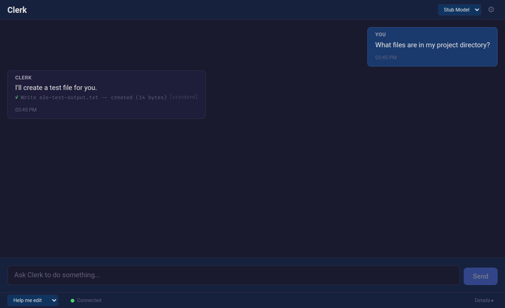
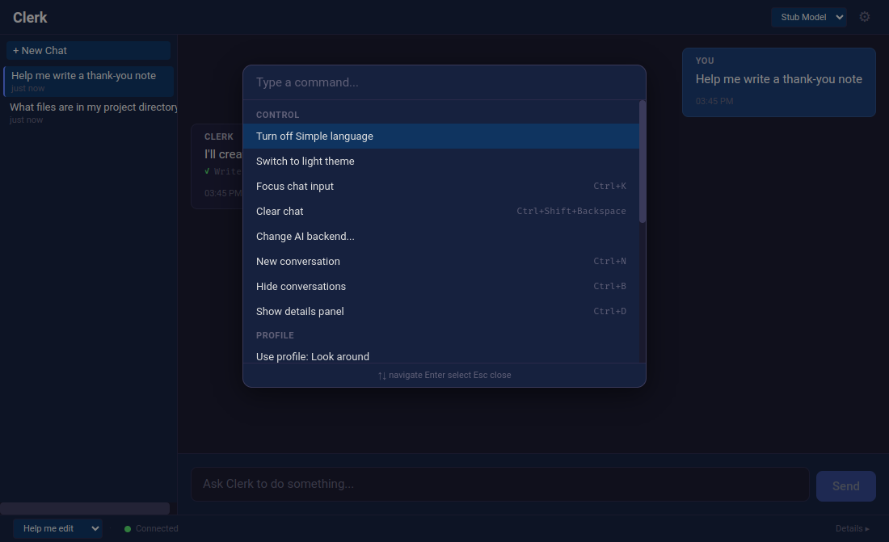
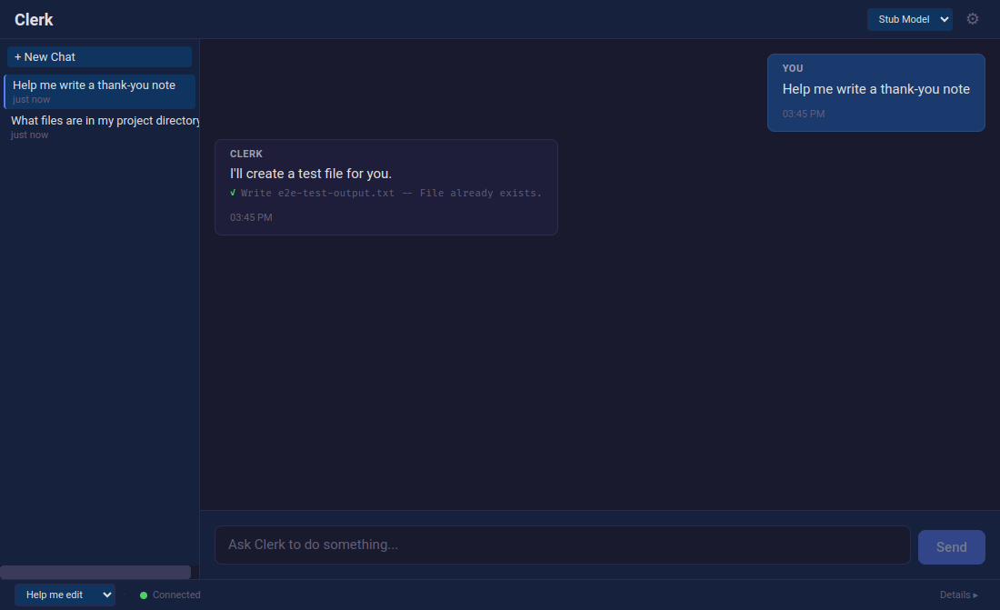

# Clerk

**A desktop assistant that keeps receipts.**

Clerk is a governed AI assistant for everyone — not just developers. It chats, manages files, and runs tasks. Every action it takes is evidence-gated, receipted, and auditable. No trust required.

Built on [Agent Governor](https://github.com/unpingable/agent_governor) (14,000+ tests, 60+ governance modules, receipt kernel).

<p align="center">
  
</p>

## What Makes Clerk Different

Most AI assistants ask you to trust them. Clerk doesn't.

- **Governed.** Every file read, write, move, and delete goes through an enforcement layer. The AI proposes; the governor decides admissibility.
- **Receipted.** Every action produces a cryptographic receipt — proof of what happened, what was allowed, and why.
- **Adjustable trust.** Four trust profiles from "look but don't touch" to full autonomy. Change them anytime from the command palette.
- **Transparent.** An activity feed shows every action the assistant took, with verdicts and receipts. Nothing is hidden.

## Features

**Chat with file operations** — Ask Clerk to read, write, patch, search, copy, move, or organize files. It uses tools to do real work, not just talk about it.

**Multiple conversations** — Create, switch, rename, and delete conversations. Your chat history persists across sessions.

<p align="center">
  
</p>

**Command palette** — Quick access to trust profiles, workflow actions, and settings with Ctrl+P.

<p align="center">
  
</p>

**Activity feed** — See every tool call, scope decision, and receipt in real time.

<p align="center">
  
</p>

**Ask before acting** — When the trust profile requires approval for a file operation, Clerk asks. You see exactly what it wants to do before allowing it.

**Simple language mode** — Toggle jargon-free labels for trust profiles, tool names, and error messages. Built for people who don't know what "scope gating" means.

## Install

Download the latest release for your platform:

**[Releases](https://github.com/unpingable/clerk/releases)**

- **Linux:** `.AppImage` or `.deb`
- **macOS:** `.dmg`
- **Windows:** `.exe` installer

Clerk requires [Agent Governor](https://github.com/unpingable/agent_governor) to be installed. The setup wizard will guide you through backend configuration on first launch.

## Build from Source

```bash
git clone https://github.com/unpingable/clerk.git
cd clerk
npm install
npm run build
npm start
```

## Development

```bash
npm run dev          # Watch mode + Electron
npm test             # Unit tests (vitest)
npm run test:e2e     # E2E tests (playwright)
npm run lint         # Type check
```

### Generate Screenshots

```bash
npm run build && npx tsx scripts/capture-screenshots.ts
```

## Keyboard Shortcuts

| Shortcut | Action |
|----------|--------|
| Ctrl+Enter | Send message |
| Ctrl+N | New conversation |
| Ctrl+B | Toggle sidebar |
| Ctrl+P | Command palette |
| Ctrl+K | Focus input |
| Ctrl+Shift+A | Toggle activity |
| Escape | Stop streaming / dismiss |

## Status

**v0.1.0** — First release. Chat, file operations, multi-conversation, persistence, trust profiles, activity feed.

## License

Apache-2.0
